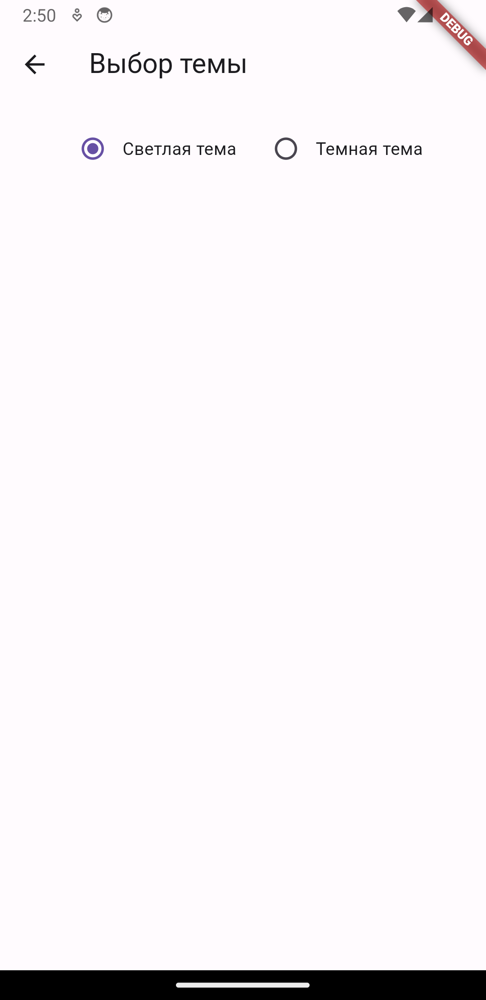

# News App

Новостное приложение на Flutter

Разработано мобильное приложение для просмотра новостных статей и добавления их в избранное с поддержкой iOS и Android, используя Flutter и Dio библиотеки для работы с удаленным API.

API, которое используется для получения данных: https://newsapi.org/v2/everything?q=apple&apiKey=MY_API_KEY

Описание экранов:

Основной экран (Новостная лента):
- Отображение новостных статей с использованием данных, полученных из удаленного API (заголовок новости, название источника).
- Вертикальная прокрутка для просмотра новостной ленты.
- Ячейки с каждой новостью для перехода к дополнительному экрану выбранной новостной статьи и просмотра ее.
- Возможность поставить/ убрать лайк для каждой новостной статьи, тем самым добавив ее в избранное.

Дополнительный экран (Подробности новости):
- Отображение подробной информации по выбранной новостной статье (картинка, заголовок, описание, контент, автор, источник, дата публикации, кнопка подробнее в источнике).

Экран профиля:
- Заголовок "Профиль".
- Возможность перейти в раздел "Понравившиеся новости".
- Возможность перейти в раздел "Выбор темы".

Экран понравившихся новостей:
- Возможность убрать лайк для каждой новостной статьи, тем самым убрав ее из избранных.
- Вертикальная прокрутка для просмотра понравившихся новостных статей.
- Ячейки с каждой понравившейся новостью для перехода к дополнительному экрану выбранной новостной статьи и ее просмотра.

Экран выбора темы:
- Возможность с помощью радиобаттонов выбрать светлую или темную тему для приложения.

Технические требования:

- Использован Dio для выполнения запросов к API с использованием синтаксиса async/await.
- Использовано SharedPrefernces для сохранения выбранной темы приложения.
- Использован таб-бар для переходов между основным экраном новостей и экраном профиля.
- Использован json_serializable для модели статьи.
- Код отформатирован (dart format).
- Линтер подключен, и код не содержит warning-ов или error-ов.
- Использование flutter_lints с правильной настройкой и отсутствием ошибок/предупреждений/информаций.
- Проект разделен на слои и логика проекта декомпозирована.
- Написан Unit-тест для ключевой функции приложения получения новостей с удаленного API.
- Реализован DI.

P.S. Обновлены скриншоты приложения.

### Скриншоты iOS

- 
- 
- 
- 
- 
- 

### Скриншоты Android

- 
- 
- 
- 
- 
- 
